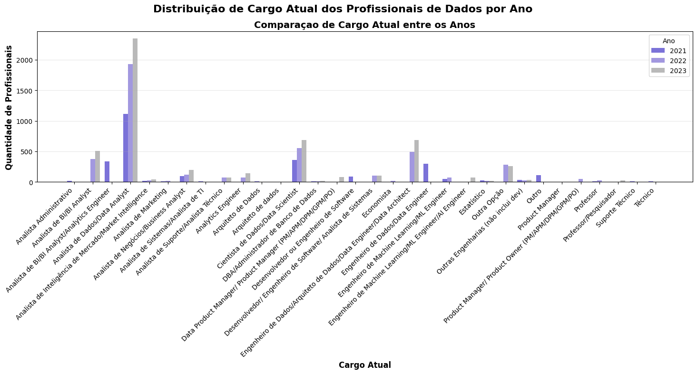
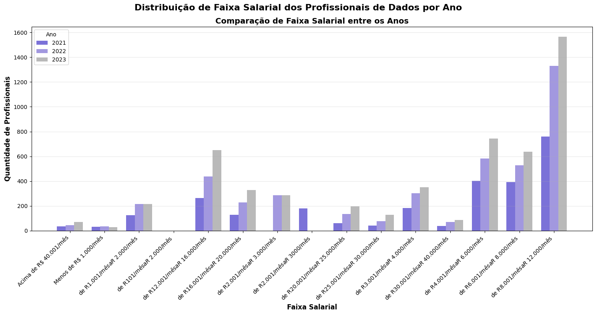
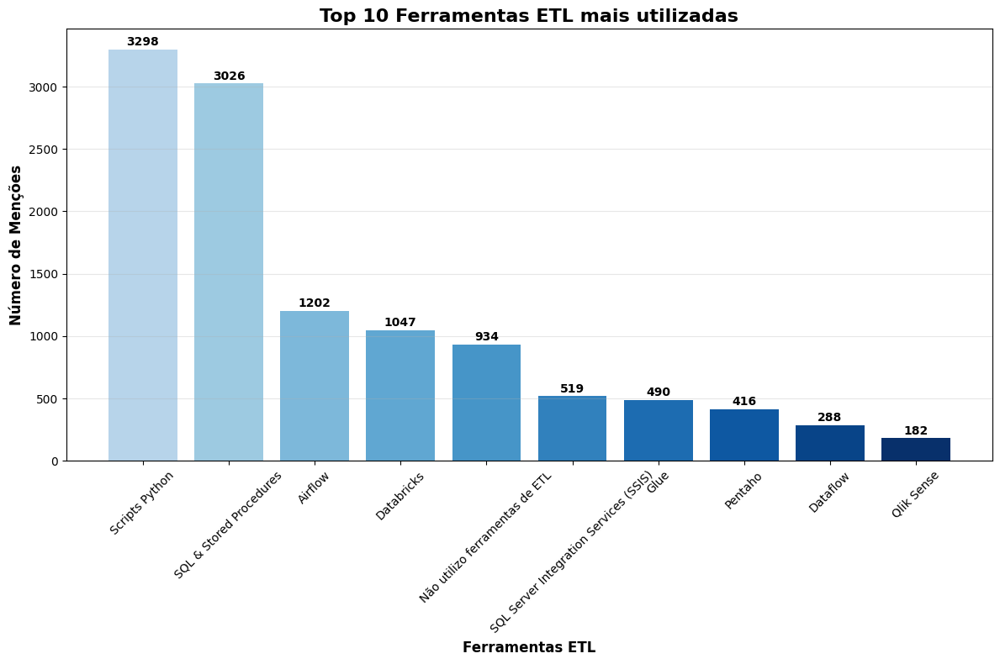
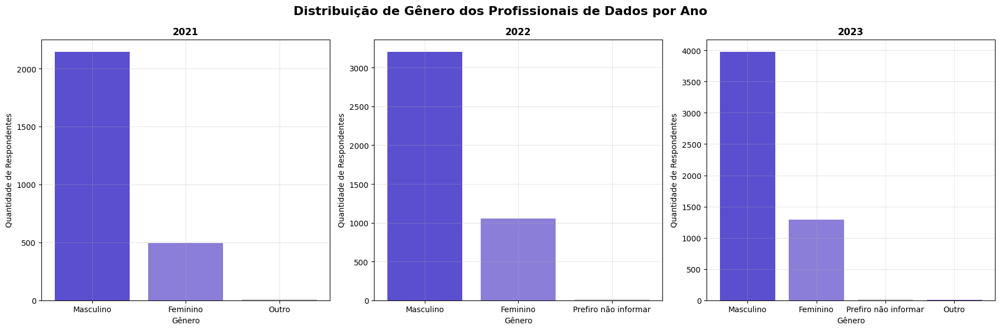
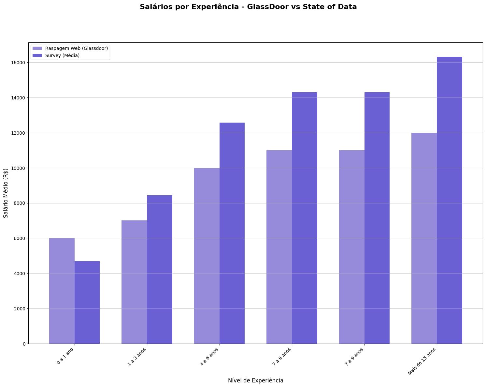
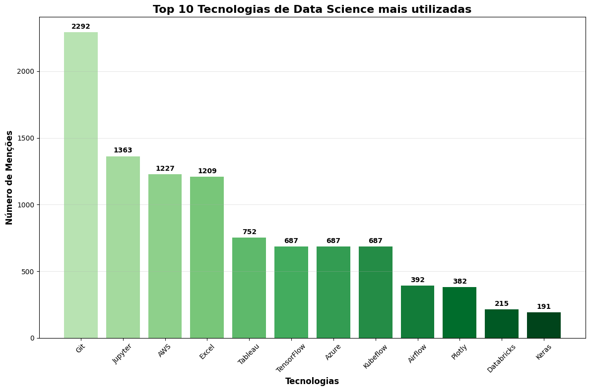
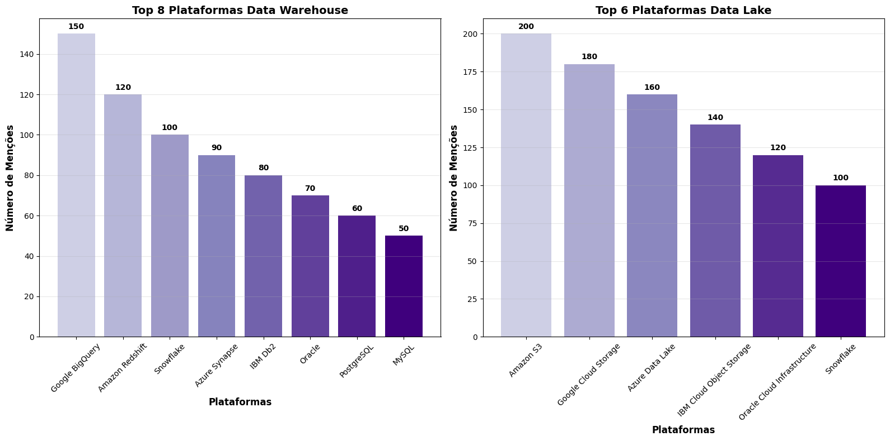

# Recuperação da Informação

# 1. Introdução

## 1.1 Objetivos do Trabalho

O Projeto tem como objetivo principal realizar uma análise do cenário de dados no Brasil, utilizando como base as pesquisas "State of Data" dos anos de 2021, 2022 e 2023. Para alcançar este objetivo, foram traçados os seguintes passos:

* **Consolidação dos Dados:** Unificar as três bases de dados anuais em um único conjunto de dados para permitir uma análise evolutiva e comparativa.
* **Limpeza e Pré-processamento:** Realizar um tratamento dos dados, incluindo a padronização de colunas, tratamento de valores ausentes e a imputação de dados quando necessário, garantindo a qualidade e a consistência das informações para a análise.
* **Enriquecimento da Base:** Complementar os dados das pesquisas com informações de salários médios por nível de experiência, obtidas através de raspagem de dados do site 'GlassDoor'(Plataforma de busca de vagas e pesquisas no mercado de trabalho), para enriquecer a análise.
* **Análise e Visualização:** Explorar o conjunto de dados para extrair insights e criar visualizações que ilustrem as principais características e tendências do mercado de dados no Brasil ao longo dos anos analisados.

### 1.2 Contexto das Bases Utilizadas

Para a realização deste estudo, foram utilizadas as seguintes fontes de dados:

* **State of Data (2021, 2022 e 2023):** As bases de dados principais são as pesquisas anuais "State of Data", que retratam o panorama do mercado de dados no Brasil. Essas pesquisas são uma referência na comunidade de dados, abrangendo uma vasta gama de informações sobre profissionais da área, como demografia, salários, ferramentas e tecnologias utilizadas. Os dados foram obtidos através do Kaggle, uma plataforma conhecida por disponibilizar datasets para análise.

* **Dados de Salários do Glassdoor:** Para aprofundar a análise de remuneração, foi realizada uma raspagem de dados (web scraping) do site **Glassdoor**. O script `raspagem.py` foi desenvolvido para extrair informações sobre a média salarial e os anos de experiência para o cargo de **Cientista de Dados no Brasil**. Os dados coletados foram armazenados no arquivo `salarios.csv` antes de serem integrados ao dataset principal.

# 2. Coleta e Organização dos Dados

## 2.1 State of Data Brazil (2021–2023)

Para a construção deste estudo, foram utilizadas as edições de 2021, 2022 e 2023 da pesquisa "State of Data Brazil". O primeiro desafio consistiu em consolidar essas três bases anuais em um único conjunto de dados coeso, o que exigiu um processo cuidadoso de pré-processamento e padronização.

O processo foi dividido nas seguintes etapas:

1.  **Junção e Seleção de Variáveis Comuns:** Inicialmente, foi realizada a união das três bases de dados. Para viabilizar a agregação correta dos dados ao longo dos anos, foi feito um trabalho de limpeza e padronização dos nomes das colunas, garantindo que variáveis correspondentes em diferentes edições da pesquisa fossem tratadas como uma só.

2.  **Seleção de Atributos:** Após a junção, foi feita uma análise criteriosa para determinar as colunas que seriam úteis para o estudo. Foram eliminadas as variáveis com uma quantidade excessiva de valores nulos e aquelas que não possuíam significância semântica para os objetivos da análise e para a eventual aplicação de modelos de Recuperação de Informação por Documentos (RDI).

3.  **Imputação de Dados Ausentes:** Por fim, foi realizado o tratamento dos valores vazios. A estratégia de imputação foi definida com base na natureza da variável:
    * Para colunas onde a ausência de resposta poderia ser interpretada como "o respondente não sabia a informação", os valores foram preenchidos com os termos **"não sei informar"** ou **"nenhuma das opções"**.
    * Para as demais colunas com dados faltantes, optou-se pela imputação utilizando a **moda estatística** das respostas, ou seja, o valor foi preenchido com a opção mais frequente (moda) para aquela variável.

Este tratamento garantiu a criação de um dataset consistente e de alta qualidade, fundamental para a validade das análises subsequentes.

## 2.2 Base via Web Scraping

Para enriquecer a análise do "State of Data" com informações salariais mais granulares, foi desenvolvida uma solução de *web scraping* para coletar dados de remuneração e nível de experiência para o cargo de Cientista de Dados no Brasil.

### 2.3 Escolha do Site

O site escolhido para a extração de dados foi o **Glassdoor**. A plataforma é uma fonte de grande relevância e volume de dados sobre o mercado de trabalho, incluindo médias salariais, que são informadas pelos próprios profissionais de forma anônima. Isso torna o Glassdoor uma fonte valiosa para obter uma perspectiva realista da remunração no setor de dados.

### 2.4 Estratégia de Coleta e Ferramentas

A coleta de dados foi automatizada por meio de um script em Python externo ao notbook principal. A estratégia envolveu a simulação da navegação humana para acessar e extrair as informações de interesse. As principais ferramentas utilizadas foram:

* **Selenium:** Foi a principal biblioteca para a automação da navegação. O Selenium permitiu controlar um navegador web (como o Chrome ou Firefox) de forma programática. Seu uso foi essencial para lidar com a natureza dinâmica do site do Glassdoor, onde muitos conteúdos são carregados via JavaScript após o carregamento inicial da página. Isso inclui a navegação entre as diferentes páginas de salários para coletar um volume de dados mais robusto.

* **Beautiful Soup:** Após o Selenium carregar as páginas, a biblioteca Beautiful Soup foi utilizada para fazer o "parse" do conteúdo HTML. Ela facilitou a navegação na estrutura do HTML da página e a extração dos dados específicos, como os valores dos salários e os respectivos níveis de experiência associados.

* **Requests:** Embora o Selenium tenha sido o motor principal da navegação, a biblioteca Requests foi utilizada para requisições HTTP mais simples em etapas iniciais ou auxiliares do processo, otimizando a coleta de dados quando a renderização completa da página não era necessária.

Os dados coletados através deste processo foram então estruturados e extraidos em um arquivo csv, então estavam prontos para serem integrados ao conjunto de dados principal do State of Data.

# 3. Integração das Bases

A etapa final do pré-processamento consistiu na integração da base de dados conslidada do "State of Data" com a base de salários do site GlassDoor. O objetivo desta etapa foi enriquecer o conjunto de dados principal, adicionando uma referência de mercado para a remuneração de um Cientista de Dados com base em seu nível de experiência.

## 3.1 Processo de Junção e Escolha das Chaves

A integração foi realizada através de uma operação de junção (*join*), combinando os arquivos do State of Data e Salarios do GlassDoor

Foi utilizado um **`LEFT JOIN`**, usando a base do State of Data como principal para grantir que todos os respondentes da pesquisa "State of Data" fossem mantidos no dataset final, independentemente de haver uma correspondência de experiência na tabela de salários.

A escolha da **chave de junção** foi o ponto crucial desta etapa. A conexão entre as duas bases foi estabelecida utilizando as colunas que representam o **nível de experiência** em ambos os conjuntos de dados.

obs: a escolha e junção dos dos datasets com certeza foram os pontos de maior dificuldade na elaboração teórica do projeto, em que foram analisados diversos sites para possível raspagem, juntamente dos dados do mesmo.

**Justificativa:** A escolha do nível de experiência como chave é a mais lógica e direta, pois o salário de um profissional está intrinsecamente ligado ao seu tempo de atação na área. Ao utilizar essa chave, foi possível mapear um salário de mercado (extraído do Glassdoor) para cada respondente da pesquisa, criando uma nova variável valiosa para análises de remuneração mais aprofundadas.

# 4. Modelagem

A etapa de modelagem deste projeto se concentrou na criação de um sistema de Recuperação de Informação por Documentos (RDI). O objetivo foi desenvolver e comparar modelos capazes de encontrar os documentos (perfis de profissionais ou descrições de vagas) mais relevantes dentro do dataset a partir de uma consulta de texto.

Para isso, foram implementadas duas abordagens distintas: uma baseada em frequência de palavras (lexical) e outra baseada em contexto e significado (semântica).

## 4.1 Abordagem 1: Modelo Lexical com TF-IDF

O primeiro modelo utilizou a técnica **TF-IDF (Term Frequency-Inverse Document Frequency)**. Esta é uma abordagem clássica de RDI que cria uma representação vetorial para cada documento com base na importância estatística das palavras que ele contém.

* **Funcionamento:** O TF-IDF atribui um peso a cada palavra em um documento. Esse peso é alto se a palavra aparece com frequência no documento em questão (TF), mas é baixo se ela aprece em muitos outros documentos do corpus (IDF). Isso destaca palavras que são distintivas para um documento específico.
* **Aplicação:** Cada documento do nosso dataset foi transformado em um vetor numérico pelo `TfidfVectorizer`.

## 4.2 Abordagem 2: Modelo Semântico com Embeddings de Transformers

A segunda abordagem, mais moderna, utilizou *word embeddings* gerados a partir de um modelo pré-treinado da arquitetura **Transformer**. Diferente do TF-IDF, que analisa palavras de forma isolada, os Transformers são capazes de compreender o contexto e o significado semântico do texto.

* **Funcionamento:** Um modelo de linguagem pré-treinado (como BERT, Sentence-BERT, etc.) foi utilizado para converter cada documento em um vetor denso de tamanho fixo (embedding). Esses vetores são posicionados em um espaço multidimensional de tal forma que textos com significados semelhantes fiquem geometricamente próximos.
* **Vantagem:** Essa técnica permite que o sistema encontre documentos relevantes mesmo que eles não compartilhem as mesmas palavras-chave da consulta, contanto que o significado seja similar.

## 4.3 Métrica de Avaliação: Similaridade de Cosseno

Para ambos os modelos, a métrica utilizada para medir a relevância entre a consulta do usuário e os documentos no dataset foi a **Similaridade de Cosseno**.

**Justificativa:** A similaridade de csseno calcula o cosseno do ângulo entre dois vetores. Ela é a métrica ideal para esta tarefa porque determina a similaridade de orientação dos vetores, independentemente de sua magnitude. Em termos práticos, ela mede o quão semanticamente ou lexicalmente parecidos são dois textos. Um valor próximo de 1 indica alta similaridade, enquanto um valor próximo de 0 indica baixa similaridade.

Ao receber uma consulta, o sistema a converte em um vetor (usando TF-IDF ou o modelo Transformer) e calcula a similaridade de cosseno deste vetor com os vetores de todos os documentos do dataset, retornando aqueles com os maiores scores de similaridade.

# 5. Visualizações e Análise Comparativa

É notório que todos os principais cargos de Dados(Analista de BI, Analista de Dados, Cientista de Dados, Engenheiro de Dados) sofreram uma alavancagem no número de profissionais ao longo dos anos 2021, 2022 e 2023, indicando uma tendência no crescimento geral da popularidade e empregabilidade da área.

# Subida visualmente e obviamente nos salários dos profissionais da área independente da faixa de seus salários. Ou seja, mais uma vez é notório uma crecente de profisssionais na área com salários correspondentes a tendência do mercado.

Predominancia de ferramentas mais utilizadas no cotidiando e mais ensinadas, assim como esperado. Como Python, SQL e Airflow.

Expressiva utilização da nova ferramenta DataBricks

# 6. Conclusão

1.  **Perfil da Comunidade:** A análise demográfica revelou um mercado de dados predominantemente masculino no Brasil.

2.  **Progressão de Carreira e Valor da Especialização:** Foi confirmada a relação entre tempo de experiência e aumento salarial. Mais importante, a comparação entre a média geral da pesquisa e o benchmark para "Cientista de Dados" sugeriu a existência de um "prêmio por especialização", onde o cargo de Cientista de Dados apresenta um potencial de remuneração superior em níveis de senioridade(levando em consideração tempo de profissão por senioridade) mais avançados.

3.  **Capacidade de Busca Semântica:** O projeto foi além da análise estatística ao desenvolver dois modelos de Recuperação de Informação por Documentos (RDI). A implementação de um modelo semântico, baseado na arquitetura Transformer, provou ser uma ferramenta poderosa para identificar perfis profissionais com base no significado de suas atribuições, superando a simples busca por palavras-chave e permitindo uma análise de similaridade muito mais sofisticada.

### Limitações do Trabalho

Apesar dos resultados robustos, é importante reconhecer as limitações deste projeto, as quais foram:

1.  **Viés dos Dados Auto-Reportados:** Tanto a pesquisa "State of Data" quanto os dados do Glassdoor são baseados em informações fornecidas pelos próprios usuários. Isso pode introduzir imprecisões ou vieses, e a amostra de respondentes pode não ser perfeitamente representativa da totalidade do mercado de trabalho em dados no Brasil.

2.  **Análise Estática da Modelagem:** Os modelos de RDI foram aplicados sobre o dataset consolidado, oferecendo uma visão "fotográfica" do cenário. Uma limitação é a não exploração da dimensão temporal, que poderia revelar como as atividades e especializações dos profissionais evoluíram ao longo do período de 2021 a 2023.
